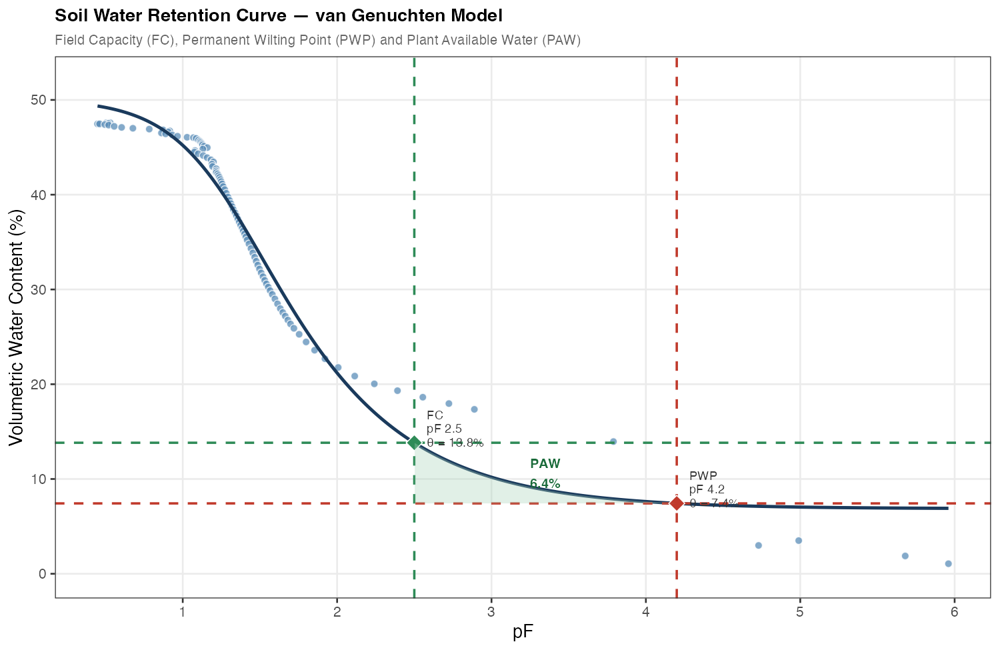

## Código Clase AGR3016

### Descripción

Este repositorio contiene funciones en **R** y **Python** para ajustar el modelo de van Genuchten (VG) a datos de la curva de retención de agua en suelo (SWRC), calcular propiedades hidráulicas y generar un gráfico tipo presentación/paper

Datos: datos anónimos proporcionados por Cristina Contreras 

Código: Sara Acevedo + Claude Anthropic Sonnet 4.5

### Ecuación de van Genuchten

$$\theta(h) = \theta_r + \frac{\theta_s - \theta_r}{\left[1 + (\alpha \, \left|h  \right|)^n\right]^{1-1/n}}$$

| Parámetro | Descripción | Unidades |
|-----------|-------------|----------|
| θ_s | Contenido de agua saturado | % |
| θ_r | Contenido de agua residual | % |
| α | Parámetro de escala (relacionado con la presión de entrada de aire) | cm⁻¹ |
| n | Parámetro de forma | adimensional |
| h | Potencial mátrico = 10^pF | cm H₂O |

### Propiedades hidráulicas calculadas

| Propiedad | Umbral pF | Potencial mátrico |
|-----------|-----------|-------------------|
| Capacidad de campo (FC) | 2.5 | −0.03 MPa |
| Punto de marchitez permanente (PWP) | 4.2 | −1.5 MPa |
| Agua disponible para plantas (PAW) | — | θ_FC − θ_PWP |

### Estructura del repositorio

```
swrc-functions/
├── data/
│   └── data-swrc.xlsx        # Datos de ejemplo (pF, VWC %)
├── R/
│   └── van_genuchten_swrc.R  # Script R (minpack.lm / nlsLM)
└── python/
    └── van_genuchten_swrc.ipynb  # Notebook Jupyter (scipy)
```

### Funciones principales

**`fit_unimodal_vg(data)`** — ajusta el modelo VG mediante mínimos cuadrados no lineales; retorna los parámetros (θ_s, θ_r, α, n), R², RMSE y AIC.

**`calculate_hydraulic(theta_s, theta_r, alpha, n)`** — calcula CC, PMP y ADP a partir de los parámetros ajustados.

### Gráfico de salida



### Uso

**R** — requiere `readxl`, `minpack.lm`, `dplyr`, `ggplot2`
```r
source("R/van_genuchten_swrc.R")
```

**Python** — requiere `numpy`, `pandas`, `scipy`, `matplotlib`, `openpyxl`

Abre el notebook directamente en Google Colab:

[](https://githubtocolab.com/Saryace/swrc-functions/blob/main/python/van_genuchten_swrc.ipynb)

> tip: para abrir cualquier notebook de este repositorio en Colab, cambia el dominio de la URL de `github.com` a `githubtocolab.com`.
